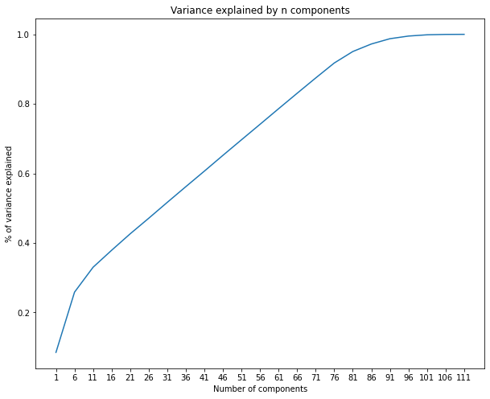
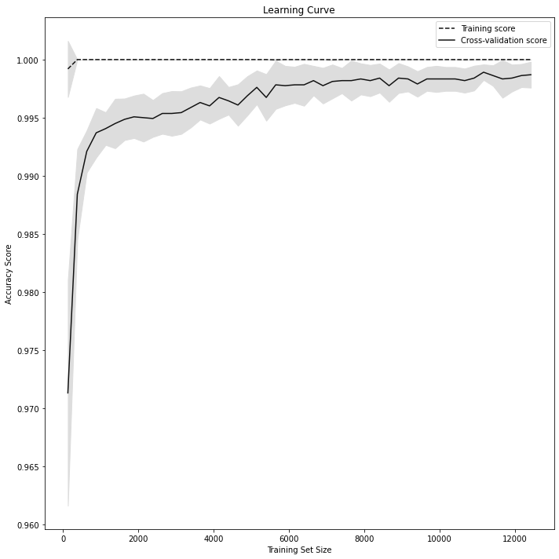
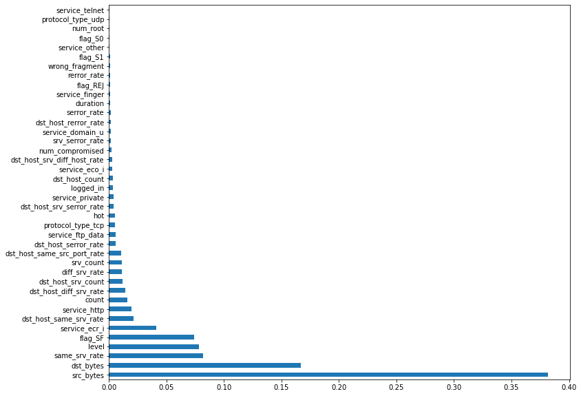
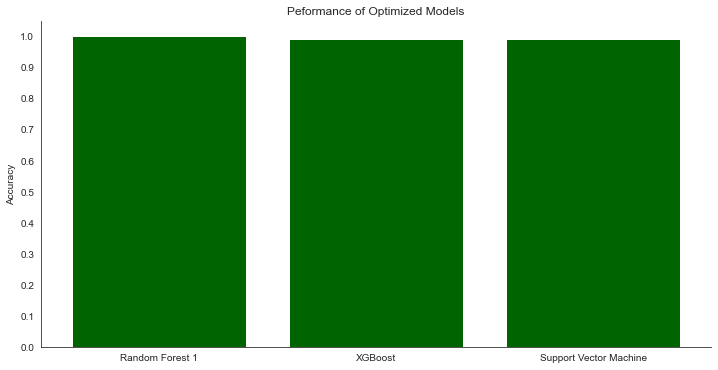

# APT Detection System using ML

# Project Overview

This project aims to classify land tracts by their type of tree cover using various machine learning algorithms. The following techniques are employed for analysis:

## Principal Components Analysis (PCA)

Principal Components Analysis is utilized to reduce the dimensionality of the dataset while retaining as much variance as possible. This technique helps mitigate the negative effects of having numerous features.

## Classification Algorithms

### 1. Random Forest Classifier

Random Forest classifiers use a collection of Decision Trees to predict labels for observations. In this project, a baseline Random Forest model is trained on class-balanced observations without scaling or PCA transformation.

### 2. XGBoost

XGBoost is an ensemble method that trains a sequence of weak learners to predict labels. It is known for its flexibility and high predictive power, making it a suitable choice for classification tasks.

### 3. Support Vector Machines (SVM)

Support Vector Machines predict labels by drawing decision boundaries in multi-dimensional space. SVM is a powerful classifier, and its performance will be evaluated for land tract classification.

## Performance Evaluation

The performance of each classification algorithm will be assessed based on their ability to accurately predict the type of tree cover. Additionally, the impact of PCA on the performance of these algorithms will be explored.

## Next Steps

The project will further investigate and compare the results obtained from these algorithms, with a focus on finding the most effective approach for classifying land tracts based on tree cover.

Feel free to refer to specific sections of the code or notebooks where these techniques are implemented for more detailed information.


## Objectives

The primary objectives of this project are as follows:

1. **Development of APT Detection System:** Create a sophisticated APT detection system using cutting-edge ML and DL-based classifiers.

2. **Performance Evaluation:** Evaluate and compare the performance and efficiency of different classifiers on the NSL-KDD dataset, a widely used benchmark for intrusion detection systems.

3. **Effectiveness Assessment:** Assess the effectiveness of each classifier in detecting and mitigating Advanced Persistent Threats.

## Getting Started

### Prerequisites
## Prerequisites

Before running the project, make sure you have the following Python libraries installed:

- **Python:** This project is built using Python. Ensure that you have Python installed on your system. You can download it from [Python's official website](https://www.python.org/).

- **Libraries:**
  - NumPy: Install using the following command:
    ```bash
    pip install numpy
    ```
  - Matplotlib: Install with:
    ```bash
    pip install matplotlib
    ```
  - Pandas: Install using:
    ```bash
    pip install pandas
    ```
  - Seaborn: Install with:
    ```bash
    pip install seaborn
    ```

## Installation

To set up the project and install the required dependencies, follow these steps:

1. **Clone the repository:**
   ```bash
   git clone https://github.com/your-username/Intrusion-Detection-System-using-Machine-Learning.git
   cd Intrusion-Detection-System-using-Machine-Learning.git
# NSL-KDD Datasets

This project uses the NSL-KDD dataset, a widely used benchmark in the field of intrusion detection. The dataset consists of training and test sets in different formats, each providing valuable insights into network security.

## Dataset Formats

1. **KDDTrain+.ARFF:**
   - Description: The full NSL-KDD train set with binary labels in ARFF (Attribute-Relation File Format) format.
   - File: `KDDTrain+.ARFF`

2. **KDDTrain+.TXT:**
   - Description: The full NSL-KDD train set including attack-type labels and difficulty level in CSV format.
   - File: `KDDTrain+.TXT`

3. **KDDTrain+_20Percent.ARFF:**
   - Description: A 20% subset of the KDDTrain+.arff file.
   - File: `KDDTrain+_20Percent.ARFF`

4. **KDDTrain+_20Percent.TXT:**
   - Description: A 20% subset of the KDDTrain+.txt file.
   - File: `KDDTrain+_20Percent.TXT`

5. **KDDTest+.ARFF:**
   - Description: The full NSL-KDD test set with binary labels in ARFF format.
   - File: `KDDTest+.ARFF`

6. **KDDTest+.TXT:**
   - Description: The full NSL-KDD test set including attack-type labels and difficulty level in CSV format.
   - File: `KDDTest+.TXT`

7. **KDDTest-21.ARFF:**
   - Description: A subset of the KDDTest+.arff file, excluding records with difficulty level of "rewrite."
   - File: `KDDTest-21.ARFF`


## Methodology

The project employs a comprehensive methodology that involves the following key steps:

1. **Classifier Selection:** Utilize a range of ML and DL techniques, including but not limited to Extreme Gradient Boosting (XGBoost), Multi-Layer Perceptron (MLP), and Convolutional Neural Networks (CNN).

2. **Dataset Training:** Train the selected classifiers on the NSL-KDD dataset, a well-established dataset for evaluating intrusion detection systems.

3. **Performance Evaluation:** Rigorously evaluate the classifiers' performance using diverse metrics to determine their efficiency in APT detection.

## Results and Findings

## Principal Components Analysis (PCA)


## learning curve for random forest


## feature importance

## accuracy for each classifer 
